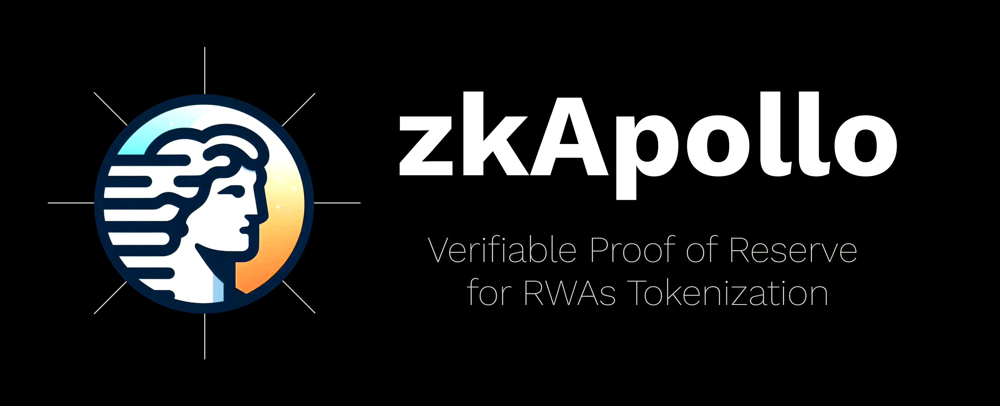

     

# zkApollo
Verifiable Proof of Reserve for RWAs Tokenization

## Why
RWAs Tokenization promises the next wave of finanial revolution. But we still lack of the standard way to verify the reserve that backing the token. Since TradFi players are joining Mina ecosystem (eg. Mirae Asset Financial Group or Copper as an institutional custodian), we believe zkApollo can be the solution to verify the reserve for RWA tokenized securities, supporting the mission of *Proof of Everything*.

## How It Works

1. Users have to hold the security asset (eg. TSLA stock) in their account eg. Copper
2. Users want to mint the mTSLA token on Mina, they have to proof that they hold the TSLA asset in their Copper account
3. For now, users have to lock MINA tokens to make sure that they won't sell their TSLA in the personal account. (we are working on the solution for this)
4. The mTSLA token is then minted on Mina and users can interact with it on the blockchain
5. Anyone can call the function `verifyReserve()` (runtime method) to see the proof of reserve anytime

## Challenges

- There is no an easy way to do value transactional since we can't access the transaction value from Mina's transaction.
- The oracle service on Mina is none, zkPass hasn't been deployed yet and ZKon isn't compatible with Protokit. So we are the first mover.

## Technology
We built on Protokit starter-kit.

## Project Structure

- `project/packages/chain`: contains the zkapp
- `project/packages/apps`: contains the frontend app

## How to run on your computer

1. git clone the repo
2. `cd project/`
3. `nvm use` : make sure you use node v18
4. `pnpm install`
5. `pnpm env:inmemory dev` : starts both UI and sequencer locally

If you want to running test, run `pnpm run test --filter=chain -- --watchAll`

## Future Developments

- Implement more ways to reduce the way that users have to lock MINA tokens (eg. KYC, multi-signature account, working with more custodians)
- Implement a new way to proof the reserve without required collaboration with the custodian
